# 🕸️ PHASE 1: DEPENDENCY MAPPING

**Date**: September 21, 2025  
**Analysis**: Complete dependency analysis between API endpoints and src/lib  
**Purpose**: Understand interconnections before Inngest migration

---

## 📊 **DEPENDENCY OVERVIEW**

### **CRITICAL DEPENDENCIES (Core Library Functions):**

```mermaid
graph TB
    subgraph "API Endpoints (16)"
        A1[agents/architect.ts]
        A2[agents/gatherer.ts]
        A3[agents/specialist.ts]
        A4[agents/shared-handler.ts]

        I1[itinerary/generate.ts]
        I2[itinerary/status.ts]
        I3[itinerary/update.ts]
        I4[itinerary/live.ts]

        W1[inngest.ts]
        W2[inngest/route.ts]
        W3[form/updates.ts]
        W4[search/providers.ts]

        C1[cache/vector.ts]
        H1[health/system.ts]
        H2[health/status.ts]
    end

    subgraph "Core Libraries (src/lib)"
        LA[agents/architect.ts]
        LG[agents/gatherer.ts]
        LS[agents/specialist.ts]
        LF[agents/form-putter.ts]

        WF[workflows/inngest-config.ts]
        WI[workflows/itinerary-workflow.ts]
        WS[workflows/state-manager.ts]

        SQ[smart-queries.ts]
        SO[search-orchestrator.ts]

        VC[vector/upstash-client.ts]
        IC[inngest/client.ts]
    end

    A1 --> LA
    A2 --> LG
    A3 --> LS
    I1 --> LA
    I1 --> LG
    I1 --> LS
    I1 --> LF
    I1 --> SQ
    W1 --> IC
    W1 --> LA
    W1 --> LG
    W1 --> LS
    W1 --> LF
    W2 --> IC
    W4 --> SO
    C1 --> VC
    I4 --> WS
    I4 --> WF
```



---

## 🤖 **AGENT ENDPOINT DEPENDENCIES**

### **High Coupling (All share core agents):**

```typescript
// SHARED BY MULTIPLE ENDPOINTS:
src/lib/agents/architect.ts      ← Used by: agents/architect, itinerary/generate, inngest.ts, inngest/route.ts
src/lib/agents/gatherer.ts       ← Used by: agents/gatherer, itinerary/generate, inngest.ts, inngest/route.ts
src/lib/agents/specialist.ts     ← Used by: agents/specialist, itinerary/generate, inngest.ts, inngest/route.ts
src/lib/agents/form-putter.ts    ← Used by: itinerary/generate, inngest.ts, inngest/route.ts

// UTILITY FUNCTIONS:
src/lib/smart-queries.ts         ← Used by: itinerary/generate, search/providers, inngest.ts, inngest/route.ts
```

### **AGENT-SPECIFIC DEPENDENCIES:**

#### **`api/agents/architect.ts`:**

```typescript
import { itineraryArchitect } from '../../src/lib/agents/architect';
import { createAgentHandler, validateArchitectRequest } from './shared-handler';
```

#### **`api/agents/gatherer.ts`:**

```typescript
import { webInformationGatherer } from '../../src/lib/agents/gatherer';
import { createAgentHandler, validateGathererRequest } from './shared-handler';
```

#### **`api/agents/specialist.ts`:**

```typescript
import { informationSpecialist } from '../../src/lib/agents/specialist';
import { createAgentHandler, validateSpecialistRequest } from './shared-handler';
```

#### **`api/agents/shared-handler.ts`:** ⚡ **CRITICAL**

```typescript
// No src/lib dependencies - pure HTTP handling logic
// This contains all the logic we need to extract
```

---

## 🗂️ **CORE API DEPENDENCIES**

### **`api/itinerary/generate.ts`:** ⚡ **HIGHEST COUPLING**

```typescript
import { itineraryArchitect } from '../../src/lib/agents/architect';
import { webInformationGatherer } from '../../src/lib/agents/gatherer';
import { informationSpecialist } from '../../src/lib/agents/specialist';
import { formPutter } from '../../src/lib/agents/form-putter';
import { generateSmartQueries, generateId } from '../../src/lib/smart-queries';

// Dependencies: 6 core library functions
// Impact: This is the main orchestration endpoint - becomes Inngest workflow
```

### **`api/itinerary/status.ts`:**

```typescript
import { workflowStateManager } from '../../src/lib/workflows/state-manager';

// Dependencies: 1 core library function
// Impact: State querying - convert to Inngest state queries
```

### **`api/itinerary/update.ts`:**

```typescript
import { formUpdateWorkflow } from '../../src/lib/workflows/form-workflow';

// Dependencies: 1 core library function
// Impact: Update processing - convert to Inngest events
```

### **`api/itinerary/live.ts`:** ⚡ **WebSocket Critical**

```typescript
import { workflowStateManager } from '../../src/lib/workflows/state-manager';
import { WORKFLOW_EVENTS } from '../../src/lib/workflows/inngest-config';

// Dependencies: 2 core library functions
// Impact: Keep as WebSocket endpoint, integrate with Inngest events
```

---

## 🔄 **WORKFLOW ENDPOINT DEPENDENCIES**

### **`api/inngest.ts`:** ⚡ **DUPLICATE COUPLING**

```typescript
import { inngest } from '../src/lib/inngest/client';
import { itineraryArchitect } from '../src/lib/agents/architect';
import { webInformationGatherer } from '../src/lib/agents/gatherer';
import { informationSpecialist } from '../src/lib/agents/specialist';
import { formPutter } from '../src/lib/agents/form-putter';
import { generateSmartQueries } from '../src/lib/smart-queries';

// Dependencies: 6 core library functions (SAME AS itinerary/generate.ts)
// Impact: This is where all agents will be consolidated
```

### **`api/inngest/route.ts`:** ⚡ **IDENTICAL DUPLICATE**

```typescript
import { inngest } from '../../src/lib/inngest/client';
import { itineraryArchitect } from '../../src/lib/agents/architect';
import { webInformationGatherer } from '../../src/lib/agents/gatherer';
import { informationSpecialist } from '../../src/lib/agents/specialist';
import { formPutter } from '../../src/lib/agents/form-putter';
import { generateSmartQueries } from '../../src/lib/smart-queries';

// Dependencies: IDENTICAL to inngest.ts
// Impact: DELETE - merge into inngest.ts
```

### **`api/search/providers.ts`:**

```typescript
import { searchOrchestrator } from '../../src/lib/search-orchestrator';
import { generateId } from '../../src/lib/smart-queries';

// Dependencies: 2 core library functions
// Impact: Move to Inngest gatherer agent
```

---

## 💾 **INFRASTRUCTURE DEPENDENCIES**

### **`api/cache/vector.ts`:**

```typescript
import { UpstashVectorClient } from '../../src/lib/vector/upstash-client';
import { performSimilaritySearch } from '../../src/lib/vector/similarity-search';

// Dependencies: 2 vector library functions
// Impact: Consolidate to /api/cache.ts
```

### **Health Endpoints:**

```typescript
// api/health/system.ts & api/health/status.ts
import { systemHealthChecks } from '../../src/api/utils/healthChecks';

// Dependencies: 1 utility function each
// Impact: Consolidate to /api/system.ts
```

---

## 🔍 **SHARED UTILITY ANALYSIS**

### **MOST USED LIBRARIES (High Impact):**

1. **`src/lib/agents/architect.ts`** - Used by 4 endpoints ⚡ **CRITICAL**
2. **`src/lib/agents/gatherer.ts`** - Used by 4 endpoints ⚡ **CRITICAL**
3. **`src/lib/agents/specialist.ts`** - Used by 4 endpoints ⚡ **CRITICAL**
4. **`src/lib/smart-queries.ts`** - Used by 4 endpoints ⚡ **CRITICAL**
5. **`src/lib/agents/form-putter.ts`** - Used by 3 endpoints

### **INNGEST SPECIFIC:**

```typescript
src/lib/inngest/client.ts        ← Used by: inngest.ts, inngest/route.ts
src/lib/workflows/inngest-config.ts ← Used by: itinerary/live.ts
src/lib/workflows/state-manager.ts  ← Used by: itinerary/status.ts, itinerary/live.ts
```

### **PROVIDER SPECIFIC:**

```typescript
src/lib/search-orchestrator.ts     ← Used by: search/providers.ts
src/lib/vector/upstash-client.ts    ← Used by: cache/vector.ts
```

---

## 🚨 **CRITICAL INSIGHTS**

### **MAJOR DUPLICATION IDENTIFIED:**

#### **Triple Agent Import Pattern:**

```typescript
// These 3 endpoints import IDENTICAL agent dependencies:
api/itinerary/generate.ts   ← All 4 agents + smart-queries
api/inngest.ts             ← All 4 agents + smart-queries
api/inngest/route.ts       ← All 4 agents + smart-queries

// SOLUTION: Consolidate all into single Inngest workflow
```

#### **Shared Handler Logic:**

```typescript
// All agent endpoints depend on shared-handler.ts
// This contains HTTP wrapper logic that becomes internal utilities
```

### **INNGEST CONSOLIDATION OPPORTUNITY:**

**Current**: 3 separate endpoints with identical dependencies  
**Target**: 1 Inngest workflow with all agents internal

**Elimination**: Remove 10+ duplicate imports across endpoints

---

## 📋 **DEPENDENCY EXTRACTION PLAN**

### **PHASE 2 PRIORITIES:**

#### **1. CONSOLIDATE INNGEST WORKFLOW:**

```typescript
// Merge these 3 endpoints into 1:
api/itinerary/generate.ts   }
api/inngest.ts             } → Single consolidated api/inngest.ts
api/inngest/route.ts       }
```

#### **2. EXTRACT SHARED LOGIC:**

```typescript
// Convert HTTP handlers to internal functions:
api/agents/shared-handler.ts → src/lib/inngest/agent-utilities.ts
```

#### **3. ELIMINATE AGENT ENDPOINTS:**

```typescript
// Delete these - logic moves to Inngest:
api/agents/architect.ts     → inngest.createFunction()
api/agents/gatherer.ts      → inngest.createFunction()
api/agents/specialist.ts    → inngest.createFunction()
```

#### **4. CONSOLIDATE INFRASTRUCTURE:**

```typescript
// Merge related endpoints:
api/health/system.ts  }
api/health/status.ts  } → api/system.ts

api/cache/vector.ts → api/cache.ts
```

---

## ✅ **P1.2 COMPLETE: DEPENDENCY MAPPING DONE**

**Key Findings**:

- **Triple duplication** in Inngest-related endpoints
- **Shared handler logic** ready for extraction
- **Clear consolidation path** identified

**Next**: P1.3 - Identify shared utilities and create extraction plan

**Status**: 🟢 **ON TRACK** - Major insights discovered
